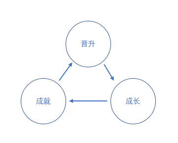
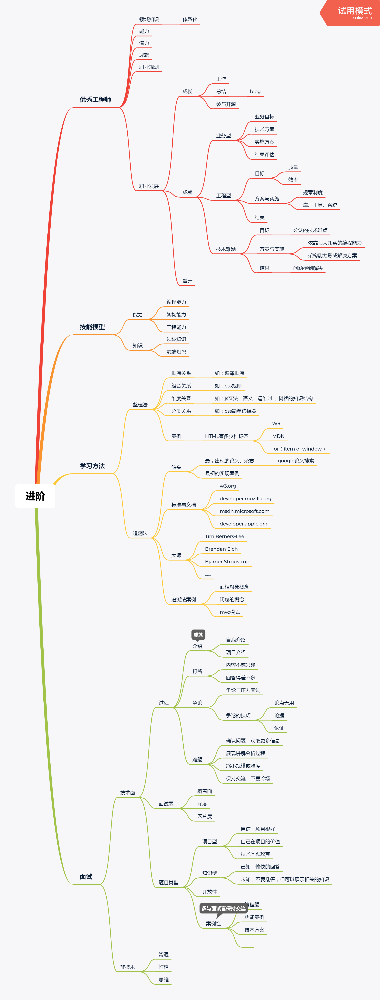

学习笔记
## 总结
### 什么是优秀的工程师
- 并非是把零散的好的地方优秀的点堆砌起来就是一个优秀的工程师，就能晋升到高的级别，而是应该有以下几点特质。
	- 体系化的前端知识、领域知识
	- 强大的编程能力、工程能力、架构能力
	- 潜力,基础牢靠，还会有很好的发展以成长空间
	- 明确的职业规划， <em>You</em> are the owner of your career!
	- 达成的成就（业务型成就、工程型成就、纯技术型成就）

### 体系化知识学习方法
- 整理法， 知识体系的完备性
- 追溯法

### 职业发展三角

# 前端进阶（记录）

## 优秀工程师

### 领域知识

- 体系化

### 能力

### 潜力

### 成就

### 职业规划

### 职业发展

- 成长

	- 工作
	- 总结

		- blog

	- 参与开源

- 成就

	- 业务型

		- 业务目标
		- 技术方案
		- 实施方案
		- 结果评估

	- 工程型

		- 目标

			- 质量
			- 效率

		- 方案与实施

			- 规章制度
			- 库、工具、系统

		- 结果

	- 技术难题

		- 目标

			- 公认的技术难点

		- 方案与实施

			- 依靠强大扎实的编程能力
			- 架构能力形成解决方案

		- 结果

			- 问题得到解决

- 晋升

## 技能模型

### 能力

- 编程能力
- 架构能力
- 工程能力

### 知识

- 领域知识
- 前端知识

## 学习方法

### 整理法

- 顺序关系

	- 如：编译顺序

- 组合关系

	- 如：css规则

- 维度关系

	- 如：js文法、语义、运维时 ，树状的知识结构

- 分类关系

	- 如：css简单选择器

- 案例

	- HTML有多少种标签

		- W3
		- MDN
		- for（item of window）

### 追溯法

- 源头

	- 最早出现的论文、杂志

		- google论文搜索

	- 最初的实现案例

- 标准与文档

	- w3.org
	- developer.mozilla.org
	- msdn.microsoft.com
	- developer.apple.org

- 大师

	- Tim Berners-Lee
	- Brendan Eich
	- Bjarner Stroustrup
	- ......

- 追溯法案例

	- 面相对象概念
	- 闭包的概念
	- mvc模式

## 面试

### 技术面

- 过程

	- 介绍

		- 自我介绍
		- 项目介绍

	- 打断

		- 内容不感兴趣
		- 回答得差不多

	- 争论

		- 争论与压力面试
		- 争论的技巧

			- 论点无用
			- 论据
			- 论证

	- 难题

		- 确认问题，获取更多信息
		- 展现讲解分析过程
		- 缩小规模或难度
		- 保持交流，不要冷场

- 面试题

	- 覆盖面
	- 深度
	- 区分度

- 题目类型

	- 项目型

		- 自信，项目很好
		- 自己在项目的价值
		- 技术问题攻克

	- 知识型

		- 已知，愉快的回答
		- 未知，不要乱答，但可以展示相关的知识

	- 开放性
	- 案例性

		- 编程题
		- 功能案例
		- 技术方案
		- ......

### 非技术

- 沟通
- 性格
- 思维

## 思维导图
[week1-note.xmind](./week1-note.xmind "dowload")

